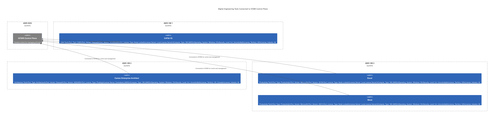

# Digital Engineering Tools Connected to ISTARI Control Plane

This project visualizes the connection of digital engineering tools to the central ISTARI control plane using **Mermaid diagrams**. The tools are deployed on **AWS infrastructure**, with each tool residing in its respective **AWS VM**.

## Tools Overview

### 1. **ISTARI Control Plane**
   - **Purpose**: Central control for managing all connected tools.
   - **Infrastructure**: Deployed on AWS EKS.

### 2. **CATIA V5**
   - **Tool Type**: CAD Tool
   - **Vendor**: Dassault
   - **Version**: V5-6R2023
   - **License**: Node Locked
   - **License Server**: Local License Server
   - **Compute Type**: VM (AWS)
   - **Operating System**: Windows 10
   - **Security Level**: IL4, Uncontrolled
   - **License Territory**: US
   - **License Industry**: All

### 3. **Cameo Enterprise Architect**
   - **Tool Type**: Architecture Tool
   - **Vendor**: Dassault
   - **Version**: 2022xR2
   - **License**: Floating
   - **License Server**: Centralized (AWS)
   - **Compute Type**: VM (AWS)
   - **Operating System**: Windows 10
   - **Security Level**: IL4, Uncontrolled
   - **License Territory**: US & Canada
   - **License Industry**: All

### 4. **Excel**
   - **Tool Type**: Productivity Tool
   - **Vendor**: Microsoft
   - **Version**: 2019
   - **License**: Node Locked
   - **License Server**: Local License Server
   - **Compute Type**: VM (AWS)
   - **Operating System**: Windows 10
   - **Security Level**: IL4, Uncontrolled
   - **License Territory**: US
   - **License Industry**: All

### 5. **Word**
   - **Tool Type**: Productivity Tool
   - **Vendor**: Microsoft
   - **Version**: 2021
   - **License**: Node Locked
   - **License Server**: Local License Server
   - **Compute Type**: VM (AWS)
   - **Operating System**: Windows 10
   - **Security Level**: IL4, Uncontrolled
   - **License Territory**: US
   - **License Industry**: All

## Visualization of the Architecture

Below is the resulting diagram showing the architecture of the digital engineering tools connected to the ISTARI control plane.

This diagram was created using Mermaid, and each tool is shown connected to the central ISTARI control plane.